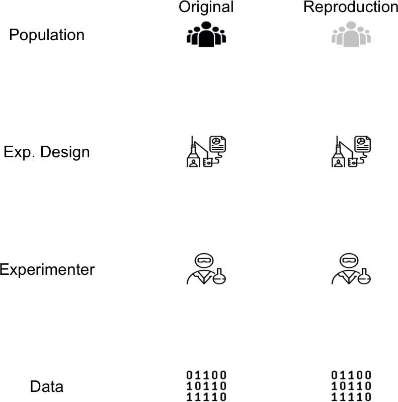
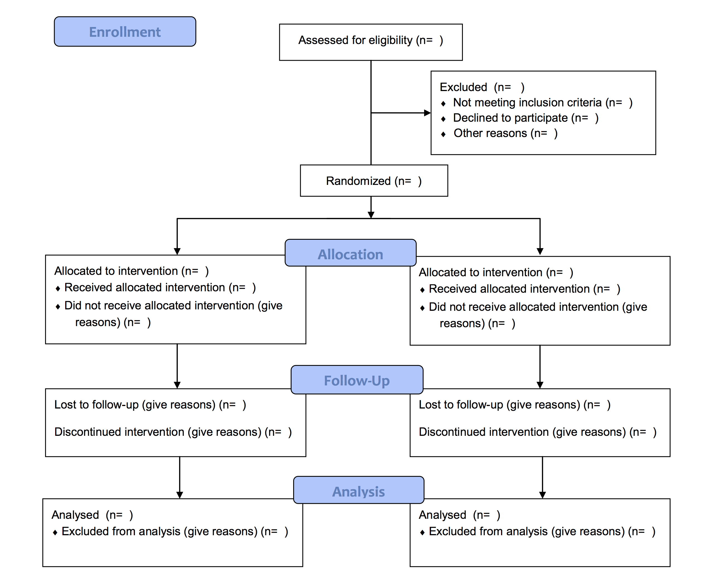
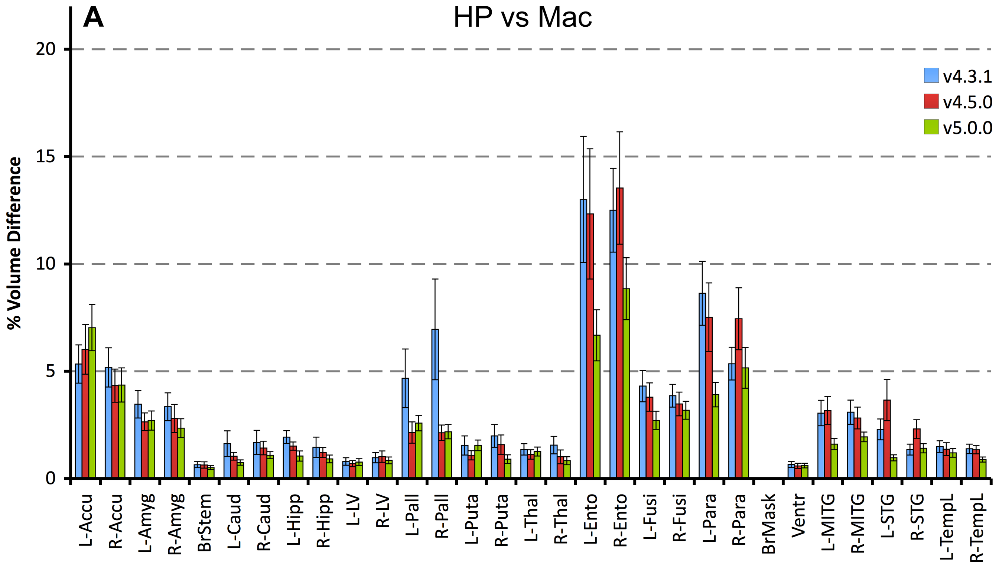
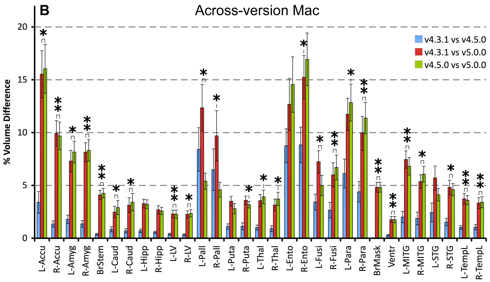
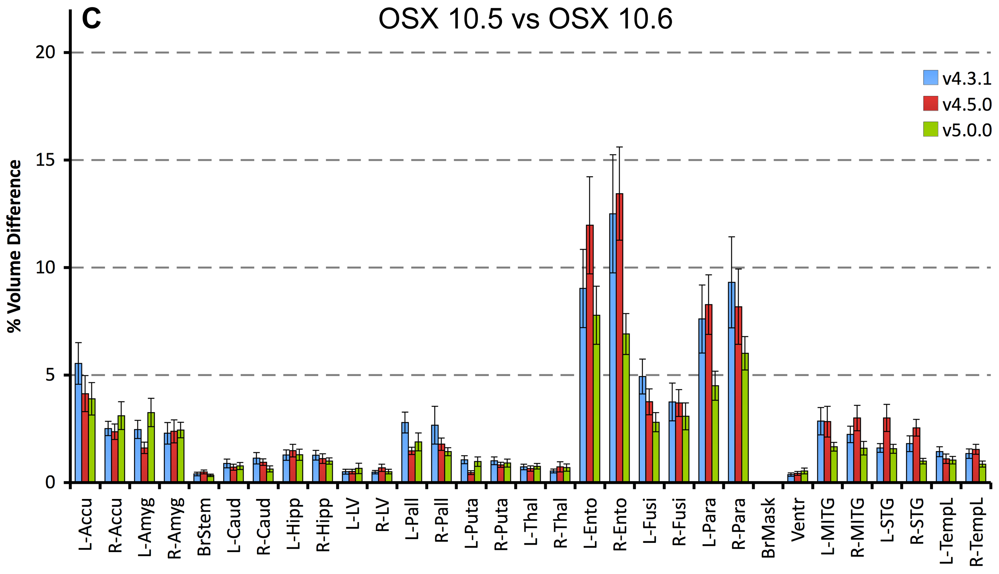
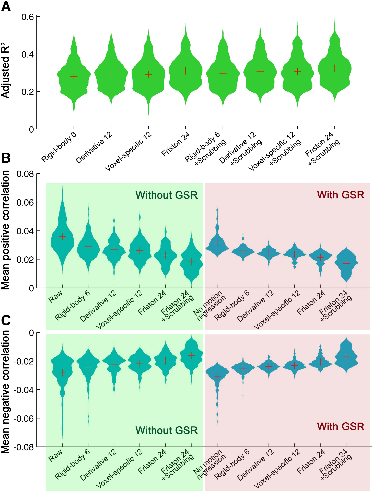

<script type="text/javascript" src="papaya.js"></script>
<script type="text/css" src="papaya.css"></script>


<style type="text/css">
article {
  font-size: 30pt;
}
</style>


```{r knit-setup, include = FALSE}
library(knitr)
opts_chunk$set(cache = FALSE, comment = "", warning = FALSE, echo = FALSE,
               message = FALSE)
library(ggplot2)
library(readr)
library(dplyr)
library(directlabels)

# library(scales)
# library(ANTsR)
# library(extrantsr)
# 
# options(fsl.path = "/usr/local/fsl/")
# options(fsl.outputtype = "NIFTI_GZ")
# library(fslr)
# 
# library(knitcitations)
# library(RefManageR)
# cleanbib()
# options(citation_format = "pandoc")
# bib <- ReadBib("index.bib", check = TRUE)
# 
# hook1 <- function(x){ gsub("```\n*```r*\n*", "", x) }
# hook2 <- function(x){ gsub("```\n+```\n", "", x) }
# knit_hooks$set(document = hook2)
```


----
<p style="font-size:10pt">https://imgflip.com/i/2ep2jb</p>
```{r, out.width = "58%", fig.align = "center"}
knitr::include_graphics("figure/reproc_definition.jpg", dpi = NA)
```


## "Reproducibility" in General

<div style="font-size:10pt">[@Patil066803]</div>

```{r, echo = FALSE, out.width = "85%", fig.align = "center"}
library(scifigure)
exps <- init_experiments(2, names = c("Original", "Reproduction"))
cols = c("#D20000", "blue", "#CDCDCD", "black")
scifigure::sci_figure(exps, showlegend = FALSE, cols = cols)
```


## Seldomly Reported Inclusion/Exclusion

<div class="left-half">

<div style="font-size:10pt">[@Patil066803]</div>
```{r crop_this_figure, echo = FALSE, out.width = "160%", fig.align = "left", fig.process = function(x) knitr::plot_crop(x, quiet = FALSE), include = FALSE}
hide_stages = c("population", "question", "hypothesis", "experimental_design", 
"experimenter", "analysis_plan")
exps <- init_experiments(2, names = c("Original", "Reproduction"))
hide_stages2 = c("population", "experimental_design", 
"experimenter", "data")
hide_stages2 = rownames(exps)[!(rownames(exps) %in% hide_stages2)]
exps[ "population", "Reproduction"] = "unobserved"
scifigure::sci_figure(exps, hide_stages = hide_stages2, showlegend = FALSE)
```

```{r, out.width = "100%"}

```

</div>
<div class="right-half">
<div style="font-size:10pt">https://imgflip.com/i/2bltgh</div>
```{r, out.width = "120%", fig.align="right"}
knitr::include_graphics("figure/consort.jpg")
```
</div>

## Solutions: RCT/CONSORT diagrams

```{r, out.width = "65%", fig.align="center"}

```

## Neuroimaging Reproducibility 

<div style="font-size:10pt">[@Patil066803]</div>

```{r, echo = FALSE, out.width = "85%", fig.align = "center"}
hide_stages = c("population", "question", "hypothesis", "experimental_design", 
"experimenter")
exps[ hide_stages, "Reproduction"] = "unobserved"
scifigure::sci_figure(exps, cols = cols)
exps[ hide_stages, "Reproduction"] = "observed"
```


## Neuroimaging Reproducibility Starts w/Data

<div style="font-size:10pt">[@Patil066803]</div>

```{r, echo = FALSE, out.width = "85%", fig.align = "center"}
hide_stages = c("population", "question", "hypothesis", "experimental_design", 
"experimenter", "analysis_plan")
scifigure::sci_figure(exps, showlegend = FALSE, hide_stages = hide_stages, cols = cols)
```

## Controversy in Neuroimaging: Won't Reproduce!

<div style="font-size:10pt">[@Patil066803]</div>

```{r, echo = FALSE, out.width = "85%", fig.align = "center"}
exps["analyst", "Reproduction"] <- "observed"
exps["data", "Reproduction"] <- "observed"
exps["code", "Reproduction"] <- "observed"
exps["analysis_plan", "Reproduction"] <- "observed"
exps["estimate", "Reproduction"] <- "different"
exps["claim", "Reproduction"] <- "different"
scifigure::sci_figure(exps, hide_stages = hide_stages, cols = cols)
```


## @gronenschild2012effects: Freesurfer Thickness
```{r, out.width = "90%"}

```


## @gronenschild2012effects: Freesurfer Thickness
```{r, out.width = "90%"}

```


## @gronenschild2012effects: Freesurfer Thickness
```{r, out.width = "90%"}

```

## @gronenschild2012effects: Freesurfer Thickness

"**The observed differences are similar in magnitude as effect sizes reported in accuracy evaluations and neurodegenerative studies.**"

## "Solutions"/Debugging: Containers

<div class="left-half">
Docker
```{r, out.width = "100%"}
knitr::include_graphics("figure/docker.png")
```
</div>
<div class="right-half">
Singularity
```{r, out.width = "80%"}

```
</div>


## Not Same as "Choosing a Pipeline"

<div style="font-size:10pt">[@Patil066803]</div>

```{r, echo = FALSE, out.width = "85%", fig.align = "center"}
exps["code", "Reproduction"] <- "different"
exps["estimate", "Reproduction"] <- "different"
exps["claim", "Reproduction"] <- "different"
scifigure::sci_figure(exps, hide_stages = hide_stages,
                      cols = cols)
```

## No General Solutions for Pipeline Choices

<div class="left-half">

 <p style="font-size:20pt">Many combinations [@yan2013comprehensive]:</p>
```{r, out.width = "75%"}

```
</div>
<div class="right-half" style="font-size:50pt">
See which predicts outcome of interest. Cross validated, of course
</div>


## Different Pipelines give Different Results

<div style="font-size:10pt">[@Patil066803]</div>

```{r, echo = FALSE, out.width = "85%", fig.align = "center"}
exps["data", "Reproduction"] <- "observed"
exps["code", "Reproduction"] <- "different"
exps["analyst", "Reproduction"] <- "different"
exps["analysis_plan", "Reproduction"] <- "observed"
exps["estimate", "Reproduction"] <- "different"
exps["claim", "Reproduction"] <- "different"
scifigure::sci_figure(exps, hide_stages = hide_stages,
                      cols = cols)
```

## Original Authors May Claim "Incorrect"

<div style="font-size:10pt">[@Patil066803]</div>

```{r, echo = FALSE, out.width = "85%", fig.align = "center"}
exps["data", "Reproduction"] <- "observed"
exps["code", "Reproduction"] <- "different"
exps["analyst", "Reproduction"] <- "different"
exps["analysis_plan", "Reproduction"] <- "observed"
exps["estimate", "Reproduction"] <- "incorrect"
exps["claim", "Reproduction"] <- "incorrect"
scifigure::sci_figure(exps, hide_stages = hide_stages,
                      cols = cols)
```


## It's typical to have lots of software choices


<div style="font-size:20pt">
Carp (2012) "The secret lives of experiments: methods reporting in the fMRI literature." Neuroimage 63.1 (2012): 289-300.
</div>
<br>
 [@carp2012secret]


## One Solution: Replication

<div style="font-size:10pt">[@Patil066803]</div>

```{r, echo = FALSE, out.width = "85%", fig.align = "center"}
ee = exps
ee[, "Reproduction"] = "observed"
ee["data", "Reproduction"] = "different"
scifigure::sci_figure(ee, hide_stages = hide_stages,
                      cols = cols)
```

## Want External Replication

<div style="font-size:10pt">[@Patil066803]</div>

```{r, echo = FALSE, out.width = "85%", fig.align = "center"}
ee = exps
ee[, "Reproduction"] = "observed"
ee["analyst", "Reproduction"] = "different"
ee["data", "Reproduction"] = "different"
scifigure::sci_figure(ee, hide_stages = hide_stages,
                      cols = cols)
```


## Minimum Reproducibility Goal 

<div style="font-size:10pt">[@Patil066803]</div>

```{r, echo = FALSE, out.width = "85%", fig.align = "center"}
nexps <- init_experiments(2, names = c("Original", "Reproduction"))
nexps["analyst", "Reproduction"] <- "different"
scifigure::sci_figure(nexps, hide_stages = hide_stages,
                      cols = cols)
```


```{r, cache = TRUE, echo = FALSE, results='hide'}
url = httr:::GET("https://neuroconductor.org/list-packages/all")
cr = httr::content(url)
tab = rvest::html_table(cr)[[1]]
nr = nrow(tab)
```


# <br> An R Platform for <br> Medical Imaging Analysis

## What is Neuroconductor?

1.  A community of developers and users of R packages for imaging
2.  A website [https://neuroconductor.org/](https://neuroconductor.org/).
    - with tutorials and help
3.  A team helping developers and users (John, Adi Gherman, Ciprian Crainiceanu, Brian Caffo)
4.  A centralized repository of maintained packages

## Goal: Centralize the packages (currently `r nr`)


----
<div class="container"> 
<div id="left_col2"> 
  <h2>Need Workflows</h2>
<div style='font-size: 24pt;'>
  
- all R code
    - interface/pipeline tool
    - "native" R code

Complete pipeline
  
  - preprocessing and analysis
</div>
  </div>    
  <div id="right_col2">

  </div>
</div>

## Many Cases in Neuroimaging: Why?

<div style="font-size:10pt">[@Patil066803]</div>

```{r, echo = FALSE, out.width = "85%", fig.align = "center"}
exps["data", "Reproduction"] <- "unobserved"
exps["code", "Reproduction"] <- "unobserved"
exps["analyst", "Reproduction"] <- "different"
exps["estimate", "Reproduction"] <- "unobserved"
exps["claim", "Reproduction"] <- "unobserved"
scifigure::sci_figure(exps, hide_stages = hide_stages, cols = cols)
```


## Data: Submitting Not Required

<table border="1">
    <tr>
    <td height="250"></td>
    <td height="250"></td>
    <td height="250"></td>
    <td height="250"></td>
    </tr>
    <tr>
    <td height="250"></td>
    <td height="250"></td>
    <td height="250"></td>
    <td height="250"></td>
    </tr>
</table>

## R packages to access these repositories

- so if there, need ability to access

2.  neurovault - access neurovault 
8.  neurohcp - Human Connectome Project
9.  Rxnat - XNAT interface (NITRC)


## Conclusions

- Reproducible code a minimum
- Need data submitted (journals need to help)
  - but need easy tools to access the data
- Analysis tools exist but need more
- Develop more standardization like BioConductor
    - standard data structures
    - publishable pipelines

# Thanks


# Example Packages


## ANTsR

Based on ANTs: Advanced Normalization Tools

- State-of-the-art image processing pipelines
- Group has won challenges for imaging analysis
- Still actively maintained and developed
- Depends on the Insight ToolKit (ITK) medical image processing library

## Using R as a Pipeline Tool: fslr

- `fslr` package - call FSL from R

- Requires FSL to be installed (only *nix systems)


## spm12r: Wrapper Functions for SPM

- Wraps some `MATLAB` code to call SPM scripts
- Using `R` syntax (but `MATLAB` runs the code)
- Built from SPM batch commands
- Shown in worked example: 
http://johnmuschelli.com/talks/fmri_task_processing/index.html#1

## neurohcp: Human Connectome Project 

- Allows you to download data from [Human Connectome Project](https://www.humanconnectome.org/)
- The 1200 Subjects release: behavioral and 3T MR imaging data from 1206 healthy young adult participants.  Standardized protocol.
- Tutorial: http://johnmuschelli.com/neuroc/neurohcp

## malf.templates: Segmented T1-weighted Images 
<div style='font-size: 20pt;'>
- Data from the MICCAI 2012 Challenge on Multi-atlas Labelling Data
- From OASIS project and the labeled data as provided by
Neuromorphometrics, Inc. (http://Neuromorphometrics.com/) 
</div>

```{r, echo = FALSE}
library(malf.templates)
library(neurobase)
L = malf_images()
L = lapply(L, `[`, 1)
lab = neurobase::readnii(L$labels)
img = neurobase::readnii(L$images)
nlabs = length(unique(c(lab)))
neurobase::ortho2(img, lab, col.y = rainbow(nlabs))
rm(list = c("lab", "img"))
```

## Current limitations

<div id="left_col" style="font-size: 28pt;">
- R is cross platform, but some packages that depend on *nix system
- Still in beta testing, but more likely to incorporate requests
- Rcpp requires compiled code, (see below)
- Licenses with data can be tricky
</div>


<div style="font-size: 10pt;">
Image from: https://imgflip.com/i/22gplr
</div>


## Training we are providing

<div class="container"> 
   <div class="left-half" style="font-size: 28pt;">
   Coursera Course: Introduction to Neurohacking In R 
  </div>
  <div class="right-half" style="font-size: 28pt;">
  
  </div>
[https://www.coursera.org/learn/neurohacking/](https://www.coursera.org/learn/neurohacking/)

<div style="font-size: 28pt;">
  http://johnmuschelli.com/imaging_in_r/
   ENAR 2018
</div>
</div>
## Bibliography

<div style = "font-size: 12pt">
